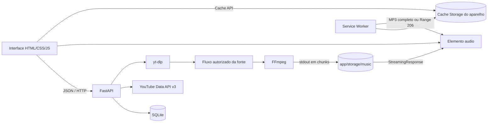
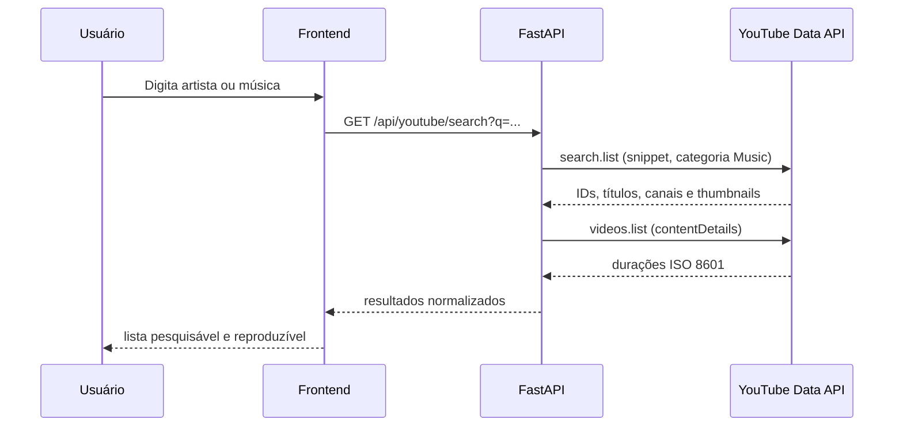
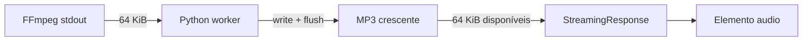

# Pulse — arquitetura, processos e guia de estudo

> Documento técnico da implementação atual. Atualizado em 23 de agosto de 2026.

Este documento explica como o Pulse funciona de ponta a ponta: tecnologias, organização do código, pesquisa, importação de áudio, download progressivo em chunks, reprodução enquanto baixa, biblioteca, armazenamento no servidor, armazenamento offline por aparelho, PWA, banco de dados, segurança, operação e assuntos que a equipe deve estudar.

## 1. Visão geral

O Pulse é uma aplicação web de música com:

- pesquisa de vídeos musicais usando a YouTube Data API v3;
- importação de áudio autorizado usando `yt-dlp` e FFmpeg;
- reprodução progressiva enquanto o arquivo ainda está sendo produzido;
- biblioteca, favoritos, histórico, pastas e playlists;
- player de áudio baseado no elemento HTML `<audio>`;
- instalação como PWA no desktop e no celular;
- cópia offline independente em cada aparelho;
- contas privadas com sessão segura e sincronização entre aparelhos;
- backend FastAPI e banco SQLite por padrão.

O projeto possui duas camadas de armazenamento de áudio que não devem ser confundidas:

| Camada | Local | Finalidade |
|---|---|---|
| Biblioteca do servidor | `app/storage/music` | Arquivo MP3 central, disponível para os clientes conectados ao servidor |
| Cópia deste aparelho | Cache Storage do navegador, cache `pulse-media-v3-user-{id}` | Reprodução sem internet naquele aparelho e naquela conta |

Uma música pode, portanto, estar na biblioteca do servidor e ainda aparecer como **Somente online** em determinado celular. Depois que a cópia é gravada no navegador, ela passa a aparecer como **Neste aparelho**.

## 2. Tecnologias utilizadas

### Backend

| Tecnologia | Papel no projeto | Conceitos envolvidos |
|---|---|---|
| Python | Linguagem do servidor | threads, subprocessos, iteradores, tratamento de erros |
| FastAPI | API HTTP e entrega da aplicação | rotas, dependency injection, validação, respostas de streaming |
| Uvicorn | Servidor ASGI | event loop, host, porta, reload de desenvolvimento |
| SQLAlchemy 2 | ORM e acesso ao banco | sessão, transação, relacionamentos, foreign keys |
| SQLite | Banco padrão | banco relacional local, integridade referencial |
| Pydantic | Validação dos contratos | schemas, limites, tipos, serialização |
| HTTPX | Cliente HTTP assíncrono | chamadas à API oficial do YouTube, timeout, erros HTTP |
| yt-dlp | Extração das informações da fonte autorizada | resolução de formatos e URL temporária do fluxo de mídia |
| FFmpeg | Processamento de mídia | demux, transcodificação, bitrate, pipes e streaming |

### Frontend e PWA

| Tecnologia | Papel no projeto | Conceitos envolvidos |
|---|---|---|
| HTML/Jinja2 | Estrutura inicial da interface | template renderizado pelo FastAPI |
| CSS responsivo | Layout desktop/mobile | media queries, safe areas, `dvh`, estados visuais |
| JavaScript sem framework | Estado e comportamento | Fetch API, eventos, áudio, Cache API, localStorage |
| HTMLMediaElement | Reprodução | `<audio>`, seek, duração, eventos de play/pause/error |
| Web App Manifest | Metadados de instalação | nome, ícones, escopo, atalhos, modo standalone |
| Service Worker | shell offline e áudio local | interceptação de requests, Cache Storage, respostas `206` |
| Cache Storage | arquivos offline por aparelho | caches versionados, Request/Response, persistência best effort |
| localStorage | snapshot de metadados | recuperação visual da biblioteca quando a API está offline |

## 3. Arquitetura



### Responsabilidade de cada diretório

```text
app/
├── api/                 Rotas HTTP separadas por domínio
├── database/            Engine, sessões e Base do SQLAlchemy
├── models/              Entidades persistidas no banco
├── schemas/             Contratos e validações Pydantic
├── services/            Regras de negócio e integrações
├── static/
│   ├── css/             Estilos desktop, mobile e estados
│   ├── images/          Ícones do PWA
│   ├── js/app.js        Controlador principal da interface
│   ├── js/service-worker.js
│   └── manifest.webmanifest
├── storage/music/       MP3s privados do servidor
├── templates/index.html
├── config.py            Configuração por ambiente
└── main.py              Composição do FastAPI
```

## 4. Inicialização da aplicação

O ponto de entrada é `run.py`.

1. `get_settings()` carrega `.env` através de `pydantic-settings`.
2. O Uvicorn inicia o FastAPI.
3. O servidor escuta em `0.0.0.0:8000` por padrão para aceitar conexões da rede.
4. O navegador do computador abre em `http://127.0.0.1:8000`.
5. No lifespan do FastAPI, a pasta de músicas é criada e `Base.metadata.create_all()` cria as tabelas ausentes.

`0.0.0.0` é um endereço de bind, não um endereço de navegação. Use `127.0.0.1` no computador ou o IP real da máquina para outro dispositivo.

### Configurações

| Variável | Padrão | Descrição |
|---|---|---|
| `YOUTUBE_API_KEY` | vazio | Chave da YouTube Data API v3 |
| `DATABASE_URL` | `sqlite:///./pulse.db` | URL SQLAlchemy do banco |
| `PULSE_APP_NAME` | `Pulse` | Nome da aplicação |
| `PULSE_DEBUG` | `false` | Modo de debug |
| `PULSE_HOST` | `0.0.0.0` | Interface de rede do servidor |
| `PULSE_PORT` | `8000` | Porta HTTP |

Nunca versione o `.env`. Chaves de API devem ser consideradas segredos e rotacionadas caso sejam expostas.

## 5. Fluxo de pesquisa



O serviço `youtube_service.py` faz duas requisições:

1. `search.list`, filtrada para vídeos e categoria musical;
2. `videos.list`, para obter a duração de cada vídeo.

A duração ISO 8601, como `PT4M12S`, é convertida para segundos. Itens incompletos, sem `videoId` ou `snippet`, são descartados. A API trata timeout, indisponibilidade, chave inválida e cota excedida.

Pesquisa e importação são processos diferentes. A API oficial é usada para descobrir metadados; ela não entrega o MP3.

## 6. Fluxo completo do download progressivo

### 6.1 Início pelo frontend

Quando o usuário dá play em um resultado que ainda não está importado, `startAutoDownload()` executa:

1. normaliza os metadados;
2. impede jobs duplicados para o mesmo `youtube_video_id` usando `state.activeDownloads`;
3. chama `POST /api/downloads`;
4. recebe um identificador de job;
5. se o play foi solicitado, define imediatamente a URL do `<audio>` como `/api/downloads/{job_id}/stream`;
6. consulta o status a cada 700 ms;
7. ao terminar, recarrega biblioteca e playlists;
8. tenta salvar automaticamente uma cópia no aparelho.

### 6.2 Criação do job

`POST /api/downloads` cria ou reaproveita o registro `Music` no banco. Se já existir `local_filename`, retorna conclusão imediata. Caso contrário, chama `start_youtube_import()`.

O job recebe um UUID e é guardado no dicionário em memória `JOBS`. O acesso é protegido por `threading.Lock`, pois a thread HTTP e a thread de download podem acessar o mesmo estado simultaneamente.

Estados atuais do job:

| Estado | Significado |
|---|---|
| `queued` | aguardando início da worker |
| `extracting` | obtendo a fonte de mídia |
| `streaming` | FFmpeg produzindo e gravando MP3 |
| `complete` | arquivo final validado e registrado |
| `failed` | processo interrompido e arquivo parcial removido |

### 6.3 O papel do yt-dlp

O Pulse usa `yt-dlp` com:

```python
{
    "format": "bestaudio/best",
    "noplaylist": True,
    "quiet": True,
    "no_warnings": True,
}
```

A chamada usa `download=False`. Isso é importante: o `yt-dlp` não grava o arquivo final. Ele interpreta a página, seleciona a melhor fonte de áudio compatível e devolve a URL temporária do fluxo. Essa URL é entregue ao FFmpeg.

O identificador recebido pela API é validado e o conteúdo é limitado a quatro horas. O serviço não implementa bypass de DRM, autenticação, paywall ou restrição técnica.

### 6.4 O papel do FFmpeg

Comando equivalente ao executado:

```text
ffmpeg -nostdin -hide_banner -loglevel error \
  -i <source_url> \
  -vn -map_metadata -1 \
  -codec:a libmp3lame -b:a 192k \
  -f mp3 pipe:1
```

Significado:

- `-i`: lê a fonte resolvida pelo `yt-dlp`;
- `-vn`: ignora vídeo;
- `-map_metadata -1`: não copia metadados da origem;
- `libmp3lame`: codifica áudio MP3;
- `-b:a 192k`: bitrate constante aproximado de 192 kbit/s;
- `-f mp3`: força o contêiner de saída;
- `pipe:1`: escreve o MP3 em `stdout`, em vez de criar o arquivo diretamente.

O FFmpeg é iniciado com `subprocess.Popen`. No Windows, `CREATE_NO_WINDOW` evita uma janela de console adicional.

### 6.5 O que significa “download em chunks” neste projeto

O Pulse não cria dezenas de arquivos separados. Existe um único arquivo MP3 que cresce durante o processo.



A worker executa repetidamente:

```python
chunk = process.stdout.read(64 * 1024)
output.write(chunk)
output.flush()
```

Cada bloco possui até 64 KiB. O `flush()` torna os bytes recém-escritos visíveis para a rota de streaming. Em paralelo, `stream_job()` abre o mesmo arquivo e acompanha uma posição de leitura:

```python
chunk = handle.read(64 * 1024)
```

Quando ainda não há bytes novos, o iterador espera 120 ms e tenta novamente. Quando há dados, usa `yield` para entregá-los à `StreamingResponse`.

Consequência: o navegador pode receber o começo válido do MP3 e iniciar a reprodução enquanto o FFmpeg ainda produz o restante.

### 6.6 Por que o MP3 é adequado aqui

MP3 permite decodificação progressiva quadro a quadro e possui amplo suporte em navegadores. O fluxo começa com dados reproduzíveis sem exigir que todo o arquivo esteja pronto. Isso simplifica a experiência de “tocar enquanto baixa”.

### 6.7 Progresso

O progresso do servidor é estimado por:

```text
bytes esperados = duração em segundos × 192.000 bits/s ÷ 8
progresso = bytes escritos ÷ bytes esperados
```

Durante a gravação, o valor é limitado a 99%. Apenas a conclusão bem-sucedida do FFmpeg produz 100%. É uma estimativa, porque contêiner, headers e comportamento da fonte podem gerar pequenas diferenças.

O frontend consulta `GET /api/downloads/{job_id}` a cada 700 ms. Esse mecanismo é polling; não é WebSocket nem Server-Sent Events.

### 6.8 Finalização e falha

Depois que o `stdout` termina:

1. o código lê o `stderr` do FFmpeg;
2. aguarda o exit code;
3. exige exit code zero e ao menos 1 KiB escrito;
4. grava apenas o nome aleatório do arquivo em `Music.local_filename`;
5. faz commit no banco;
6. marca o job como `complete`.

Em caso de erro, o arquivo parcial é removido e o job passa para `failed`.

## 7. Armazenamento no servidor

Os MP3s ficam em:

```text
app/storage/music/<uuid-aleatorio>.mp3
```

O banco não armazena o áudio, somente metadados e `local_filename`. O nome aleatório reduz colisões e evita expor o título original no filesystem.

A rota privada lógica é:

```http
GET /api/media/music/{music_id}
```

Ela busca a música no banco, resolve o arquivo e retorna `FileResponse`. `resolve_media_file()` protege o acesso ao disco:

- aceita apenas o nome do arquivo, sem diretórios;
- verifica extensões permitidas;
- resolve o caminho absoluto;
- confirma que o destino continua dentro da pasta de storage;
- confirma que o arquivo existe.

Isso reduz risco de path traversal, como tentativas com `../../arquivo`.

Quando uma música é removida da biblioteca, o registro e o MP3 do servidor são apagados. A interface também remove a cópia do aparelho atual. Outros aparelhos não recebem uma ordem remota de limpeza e podem manter uma cópia isolada até que seus próprios dados do site sejam limpos.

## 8. Armazenamento offline no celular e desktop

### 8.1 Onde o arquivo fica

A cópia offline fica no armazenamento privado do navegador/PWA, dentro do Cache Storage chamado:

```text
pulse-media-v3-user-{id_da_conta}
```

Esse arquivo não aparece na pasta pública “Downloads”, no app de arquivos ou no app de música do Android/iOS. Ele pertence ao domínio do Pulse e é consumido pelo próprio PWA. Expor um MP3 como arquivo público exigiria um fluxo separado de download explícito controlado pelo navegador.

### 8.2 Como uma faixa é salva

`saveTrackOnDevice()`:

1. confirma que a música já possui MP3 no servidor;
2. chama `navigator.storage.persist()` como solicitação best effort;
3. busca `/api/media/music/{id}` sem reutilizar cache HTTP comum;
4. abre o cache isolado `pulse-media-v3-user-{id}`;
5. grava o objeto `Response` com `cache.put()`;
6. adiciona o ID ao conjunto `state.deviceOfflineIds`;
7. atualiza selos, filtros e ações.

Downloads novos tentam essa etapa automaticamente após a importação do servidor. Faixas antigas podem ser salvas pelo ícone amarelo ou pelo menu contextual.

### 8.3 Como o Pulse descobre o que existe no aparelho

Na inicialização, `loadDeviceOfflineIndex()` abre o cache da conta autenticada e extrai os IDs das URLs `/api/media/music/{id}?account={user_id}`. A disponibilidade offline não é inferida do banco, porque cada conta em cada aparelho possui seu próprio cache.

Estados visuais:

- **Neste aparelho**, verde: existe uma resposta de áudio no Cache Storage local;
- **Somente online**, amarelo: existe MP3 no servidor, mas não neste aparelho;
- sem selo: resultado ainda não importado ou metadado sem mídia final.

O filtro **Neste aparelho** mostra apenas as faixas reproduzíveis sem conexão.

### 8.4 Reprodução offline e requisições Range

Players de áudio normalmente enviam um header como:

```http
Range: bytes=1048576-
```

Isso permite buscar ou avançar para uma parte específica do arquivo. O service worker intercepta `/api/media/music/` antes da regra que ignora outras APIs.

Se o arquivo estiver no cache:

1. lê o `Range` solicitado;
2. obtém o Blob armazenado;
3. recorta apenas o intervalo necessário;
4. responde com status `206 Partial Content`;
5. inclui `Content-Range`, `Content-Length`, `Accept-Ranges` e `Content-Type`.

Sem `Range`, retorna a resposta completa. Se não existir cópia no cache, tenta a rede. Em modo offline, uma faixa marcada como **Somente online** é bloqueada com uma mensagem clara.

### 8.5 Metadados offline

Cachear o MP3 não basta para navegar. Por isso `saveClientSnapshot()` guarda no `localStorage` um snapshot de:

- biblioteca;
- playlists;
- pastas;
- histórico recente.

Quando as APIs falham por falta de rede, `restoreClientSnapshot()` reconstitui a interface. O MP3 vem do Cache Storage e os metadados vêm do localStorage.

### 8.6 Limites do armazenamento do navegador

- a cota é definida pelo navegador e pelo espaço disponível;
- `navigator.storage.persist()` é apenas uma solicitação, não uma garantia;
- o sistema pode remover dados não persistentes sob pressão de armazenamento;
- limpar “dados do site” remove músicas offline, snapshot e preferências;
- modo anônimo não deve ser considerado persistente;
- cada navegador/perfil tem armazenamento independente;
- Cache Storage e service workers exigem contexto seguro.

Para produção, a interface deveria apresentar uso estimado por `navigator.storage.estimate()`, permitir download de playlists e avisar quando a cota estiver próxima do limite.

## 9. PWA e instalação

O manifest define:

- `start_url` e `scope` em `/`;
- exibição `standalone`;
- ícones 192×192 e 512×512;
- cores de tema e fundo;
- atalhos para pesquisa e biblioteca;
- `launch_handler` para reutilizar uma janela existente.

O fluxo de instalação é intencionalmente iniciado apenas por botão:

1. o navegador emite `beforeinstallprompt`;
2. o Pulse chama `preventDefault()` e guarda o evento;
3. nenhum prompt é aberto automaticamente;
4. o usuário pressiona **Instalar app**;
5. o código chama `prompt()`;
6. após aceite, mostra loading indeterminado;
7. `appinstalled` confirma o término real.

O navegador não fornece percentual de download do PWA. O loading é indeterminado e termina somente no evento real de conclusão.

No iOS, o Safari não oferece o mesmo prompt programático. O botão apresenta as etapas nativas de “Adicionar à Tela de Início”. Nenhum site pode confirmar silenciosamente uma instalação; isso é uma proteção do navegador e do sistema operacional.

### HTTPS

Service workers, Cache Storage persistente e instalação exigem contexto seguro:

- `http://localhost` e `http://127.0.0.1` são exceções de desenvolvimento;
- `http://192.168.x.x:8000` no celular não é contexto seguro;
- em rede ou produção, use HTTPS com certificado confiável;
- uma configuração comum é FastAPI atrás de Caddy, Nginx, Traefik ou Cloudflare.

## 10. Banco de dados

### Entidades

| Tabela | Responsabilidade |
|---|---|
| `music` | metadados, favorito e referência do MP3 |
| `playlists` | nome, descrição, capa e pasta |
| `playlist_music` | associação N:N, posição e data de inclusão |
| `folders` | organização hierárquica de playlists |
| `playback_history` | eventos de reprodução |
| `settings` | estado serializado do player |
| `users` | perfil, credenciais derivadas e preferência de sincronização |
| `user_sessions` | hash dos tokens de sessão e expiração |
| `user_music` | vínculo privado entre conta e música, favorito e data de inclusão |
| `friendships` | convite e amizade aceita entre duas contas |

`playlist_music` possui chave composta e restrição única para impedir duplicidade. Foreign keys do SQLite são ativadas explicitamente com `PRAGMA foreign_keys=ON`.

O estado de reprodução da conta salva música atual, posição, shuffle e repeat. O contrato ainda aceita `volume` por compatibilidade, mas o cliente usa `pulse:volume:{user_id}` no `localStorage`: volume e mute pertencem ao aparelho para que silenciar o desktop não deixe o celular mudo. Um aparelho novo começa em 75%. O histórico recente retorna no máximo 30 músicas distintas.

`music` representa o arquivo físico deduplicado. `user_music` define quem pode enxergá-lo. Dessa forma, duas contas podem usar o mesmo MP3 sem misturar bibliotecas, favoritos ou datas de inclusão.

### SQLite e crescimento

SQLite é adequado para desenvolvimento, uso pessoal e uma única instância. Para múltiplos usuários ou processos concorrentes, prefira PostgreSQL. A troca exige uma URL SQLAlchemy compatível, driver do banco e migrações formais, idealmente com Alembic.

## 11. API HTTP

### Pesquisa

| Método | Rota | Função |
|---|---|---|
| `GET` | `/api/youtube/search?q=&limit=` | pesquisa vídeos musicais |

### Conta

| Método | Rota | Função |
|---|---|---|
| `POST` | `/api/auth/register` | cria conta e inicia sessão |
| `POST` | `/api/auth/login` | autentica e inicia sessão |
| `POST` | `/api/auth/logout` | encerra a sessão atual |
| `GET` | `/api/auth/me` | retorna o perfil autenticado |
| `PATCH` | `/api/auth/preferences` | altera sincronização automática |

### Downloads e mídia

| Método | Rota | Função |
|---|---|---|
| `POST` | `/api/downloads` | cria/reaproveita música e inicia job |
| `GET` | `/api/downloads/{job_id}` | consulta estado e progresso |
| `GET` | `/api/downloads/{job_id}/stream` | acompanha o MP3 crescente |
| `GET` | `/api/media/music/{music_id}` | entrega o MP3 final |

### Biblioteca

| Método | Rota | Função |
|---|---|---|
| `GET` | `/api/library` | lista músicas |
| `POST` | `/api/library` | cria metadados |
| `DELETE` | `/api/library/{id}` | remove registro e mídia |
| `PATCH` | `/api/library/{id}/favorite` | alterna favorito |
| `POST` | `/api/library/history` | registra reprodução |
| `GET` | `/api/library/history/recent` | histórico recente |

### Coleções e player

| Método | Rota | Função |
|---|---|---|
| `GET/POST` | `/api/playlists` | lista ou cria playlist |
| `DELETE` | `/api/playlists/{id}` | remove playlist |
| `POST/DELETE` | `/api/playlists/{id}/tracks/{music_id}` | adiciona/remove faixa |
| `PUT` | `/api/playlists/{id}/reorder` | reordena faixas |
| `GET/POST` | `/api/folders` | lista ou cria pasta |
| `GET/PUT` | `/api/player/state` | lê ou salva estado do player |
| `GET` | `/api/lyrics/{music_id}` | obtém letra comum ou sincronizada, com cache local |
| `GET` | `/api/health` | health check simples |

### Social e salas

| Método | Rota | Função |
|---|---|---|
| `GET` | `/api/social/users?q=` | pesquisa perfis pelo nome |
| `GET` | `/api/social/users/{id}/playlists` | lista playlists públicas |
| `GET` | `/api/social/friends` | lista amizades aceitas |
| `GET` | `/api/social/friends/requests` | lista convites recebidos |
| `POST` | `/api/social/friends/{id}` | envia convite |
| `POST` | `/api/social/friends/{id}/accept` | aceita convite |
| `DELETE` | `/api/social/friends/{id}` | remove convite ou amizade |
| `POST` | `/api/rooms` | cria sala temporária |
| `POST` | `/api/rooms/{code}/join` | entra em sala de um amigo |
| `GET` | `/api/rooms/{code}` | consulta snapshot da sala |
| `GET` | `/api/rooms/{code}/media/{music_id}` | mídia autorizada para participantes |
| `WS` | `/ws/rooms/{code}` | chat, fila e sincronização em tempo real |

A documentação interativa padrão do FastAPI fica disponível em `/docs` enquanto não for desabilitada por configuração de produção.

## 12. Estado do frontend

O objeto `state` mantém:

- tela ativa;
- biblioteca, playlists, pastas, pesquisa e histórico;
- fila, índice atual, shuffle e repeat;
- música atual, volume e fonte do áudio;
- downloads ativos por `youtube_video_id`;
- IDs salvos no aparelho;
- IDs atualmente sendo copiados para o aparelho;
- filtro da biblioteca.

Não existe framework de estado. Funções como `renderAll()`, `renderLibrary()` e `refreshPlayingUI()` transformam o estado em HTML e classes CSS.

`normalized()` adapta nomes vindos de diferentes contratos, e `escapeHtml()` protege conteúdo interpolado contra injeção HTML básica. Dados de APIs nunca devem ser inseridos diretamente sem escape.

## 13. Concorrência e modelo de execução

Há três tipos de concorrência:

1. HTTP assíncrono para pesquisa, usando HTTPX;
2. thread daemon por importação, para não bloquear a resposta FastAPI;
3. subprocesso FFmpeg por importação.

O dicionário `JOBS` existe apenas na memória do processo. Consequências:

- reiniciar o servidor perde o status dos jobs;
- múltiplos workers não compartilham jobs;
- dois processos podem apresentar estados diferentes;
- não existe retomada automática de job interrompido.

Para produção distribuída, substitua por uma fila como Celery/RQ/Arq, Redis para estado, workers dedicados e uma tabela persistente de jobs.

## 14. Segurança, privacidade e uso autorizado

### Limite legal

O importador deve ser usado somente para conteúdo próprio, licenciado, em domínio público ou expressamente autorizado. A existência técnica de uma fonte não concede direito de cópia. O projeto não deve ser alterado para contornar DRM, autenticação, paywalls, restrições geográficas ou mecanismos de proteção.

### Proteções existentes

- validação Pydantic de tamanhos, tipos e formato de `youtube_video_id`;
- limite de quatro horas por conteúdo;
- playlists desativadas no `yt-dlp`;
- caminhos de mídia resolvidos dentro do storage;
- extensões permitidas;
- nomes de arquivo aleatórios;
- erros externos transformados em mensagens controladas;
- metadados removidos pelo FFmpeg;
- arquivos parciais apagados em falha.

### Lacunas antes de publicar para terceiros

A versão atual implementa contas, sessões e autorização por recurso, mas ainda precisa de hardening operacional antes de uma publicação ampla:

- confirmação e recuperação de e-mail;
- redefinição e política de senha;
- limitação de tentativas de login;
- revogação de todas as sessões e painel de aparelhos;
- proteção contra abuso e rate limiting;
- limites de duração, tamanho, espaço e jobs simultâneos por usuário;
- CSRF quando autenticação usar cookies;
- política de conteúdo e processo de remoção;
- logs sem segredos ou URLs temporárias;
- backup do banco e da mídia;
- headers de segurança e proxy HTTPS;
- varredura e atualização frequente de dependências.

## 15. Tratamento de erros e diagnóstico

### `WinError 10013`

Indica que o Windows negou o bind da porta. Causas comuns:

- porta ocupada;
- porta reservada pelo sistema;
- firewall ou antivírus;
- processo anterior ainda em execução.

Diagnóstico em PowerShell:

```powershell
Get-NetTCPConnection -LocalPort 8000 -ErrorAction SilentlyContinue
```

É possível trocar a porta:

```env
PULSE_PORT=8010
```

### FFmpeg não encontrado

Teste:

```powershell
ffmpeg -version
```

O executável precisa estar no `PATH` do mesmo terminal que inicia o Python.

### Pesquisa indisponível

Verifique:

- `YOUTUBE_API_KEY` configurada;
- YouTube Data API v3 ativada no projeto Google;
- cota disponível;
- data/hora e conexão do servidor;
- restrições da chave compatíveis com uso no backend.

### Instalação ou offline não funciona no celular

Verifique no DevTools remoto:

- a página está em HTTPS;
- o manifest retorna `application/manifest+json` ou tipo aceito;
- o service worker está ativo e controla a página;
- `pulse-shell-v25` e `pulse-media-v3-user-{id}` existem em Application → Cache Storage;
- o aparelho possui espaço;
- a música mostra **Neste aparelho** antes de ativar modo avião.

Após atualizar o service worker, feche totalmente o PWA e abra novamente. Em desenvolvimento, `Ctrl+F5` no desktop força a recarga dos assets.

## 16. Testes recomendados

### Teste do fluxo progressivo

1. escolha conteúdo curto e autorizado;
2. confirme que `POST /api/downloads` retorna `202`;
3. abra `/stream` imediatamente;
4. confirme que os primeiros bytes chegam antes de o job atingir 100%;
5. valide o MP3 final com `ffprobe`;
6. confirme `local_filename` no banco;
7. reinicie e reproduza novamente pela rota final.

### Teste offline por aparelho

1. abra o PWA em contexto HTTPS;
2. salve uma música;
3. confirme o selo **Neste aparelho**;
4. confira `pulse-media-v3-user-{id}` no Cache Storage;
5. ative modo avião;
6. feche e reabra o PWA;
7. navegue pelo filtro **Neste aparelho**;
8. reproduza, pause e faça seek;
9. remova a cópia local e confirme que a música continua na biblioteca online.

### Automação desejável

- testes unitários de duração ISO 8601;
- testes de validação de paths;
- testes de serialização de biblioteca e playlists;
- testes de endpoints com FastAPI TestClient;
- teste de worker com FFmpeg e fonte controlada;
- teste end-to-end PWA com Playwright;
- teste de service worker com requests `Range`;
- teste de quota/erro do Cache Storage;
- teste de atualização entre versões do service worker.

## 17. O que a equipe deve estudar

### Fundamentos web

1. HTTP: métodos, status, headers, cache e MIME types;
2. streaming HTTP e transferência sem `Content-Length`;
3. requests `Range`, respostas `206` e `416`;
4. Fetch API, Promises e async/await;
5. ciclo de vida do `<audio>` e políticas de autoplay;
6. responsive design, acessibilidade e safe areas mobile.

### Backend Python

1. FastAPI, ASGI e Uvicorn;
2. Pydantic e validação de contratos;
3. SQLAlchemy 2, sessões, transações e relacionamentos;
4. generators/iterators e `StreamingResponse`;
5. threads, locks e condições de corrida;
6. `subprocess.Popen`, stdin/stdout/stderr e exit codes;
7. filas de tarefas e processamento distribuído.

### Áudio e mídia

1. diferença entre codec e contêiner;
2. bitrate, sample rate, canais e qualidade percebida;
3. MP3 frames e reprodução progressiva;
4. FFmpeg, demuxers, decoders, encoders e pipes;
5. URLs temporárias de mídia e expiração;
6. metadata, normalização de volume e análise com `ffprobe`.

### PWA e offline-first

1. manifest e critérios de instalação;
2. ciclo de vida do service worker: install, activate e fetch;
3. Cache Storage versus HTTP cache versus localStorage;
4. estratégias cache-first, network-first e stale-while-revalidate;
5. storage quota, eviction e persistência;
6. atualização de service workers;
7. limitações específicas de Android, iOS e navegadores desktop.

### Segurança e operação

1. autenticação, autorização e isolamento multiusuário;
2. gerenciamento de segredos;
3. path traversal, XSS, CSRF, SSRF e rate limiting;
4. HTTPS, certificados e reverse proxies;
5. logs estruturados, métricas e tracing;
6. backup, retenção e recuperação;
7. licenciamento e direitos sobre conteúdo digital.

## 18. Melhorias arquiteturais recomendadas

### Curto prazo

- persistir jobs no banco;
- adicionar cancelamento de download;
- limitar jobs simultâneos;
- exibir espaço usado e disponível no aparelho;
- permitir baixar/remover playlist inteira;
- limpar jobs antigos da memória;
- testar automaticamente arquivos finais com `ffprobe`;
- oferecer retry explícito e detalhado.

### Médio prazo

- PostgreSQL e Alembic;
- Redis e workers dedicados;
- recuperação de conta, verificação de e-mail e gestão de sessões;
- armazenamento de mídia em volume externo ou object storage;
- observabilidade de FFmpeg, latência e falhas por fonte;
- sincronização de preferências entre aparelhos;
- política de retenção e limites por conta.

### Longo prazo

- streaming adaptativo quando houver necessidade real;
- CDN para mídia autorizada;
- downloads offline em lote com gerenciamento de quota;
- transcodificações alternativas conforme suporte do navegador;
- aplicativo nativo caso seja necessário integrar os arquivos à biblioteca pública de mídia do sistema.

## 19. Contas, privacidade e sincronização automática

### Cadastro e senha

O cadastro recebe nome, e-mail e uma senha de no mínimo oito caracteres. O e-mail é normalizado para letras minúsculas e possui índice único.

A senha nunca é armazenada em texto puro. `hash_password()` usa `hashlib.scrypt` com:

- salt aleatório de 16 bytes;
- `N = 2^14`;
- `r = 8`;
- `p = 1`;
- saída de 32 bytes.

O valor persistido contém algoritmo, parâmetros, salt e derivação. A comparação usa `hmac.compare_digest()` para reduzir diferenças observáveis de tempo.

### Sessão

No login ou cadastro:

1. o servidor gera 32 bytes aleatórios com `secrets.token_urlsafe()`;
2. envia o token em cookie `pulse_session`;
3. salva no banco somente o SHA-256 do token;
4. configura `HttpOnly`, `SameSite=Lax`, escopo `/` e validade de 30 dias;
5. ativa `Secure` quando a requisição é HTTPS.

JavaScript não consegue ler o cookie `HttpOnly`. Cada request same-origin envia o cookie automaticamente. `get_current_user()` compara o hash e a expiração antes de liberar a rota.

### Isolamento de dados

Todas as rotas de biblioteca, downloads, playlists, pastas, histórico, estado do player e mídia dependem do usuário autenticado. IDs de objetos não são suficientes: a consulta também exige vínculo com a conta.

O MP3 físico pode ser compartilhado internamente para economizar disco, mas `user_music` controla autorização. Remover uma música de uma conta apaga seu vínculo, histórico e entradas de playlists. O MP3 só é removido quando nenhuma conta restante o utiliza.

### Migração dos dados anteriores

Bancos SQLite antigos recebem de forma aditiva as colunas `user_id` e as novas tabelas. A primeira conta cadastrada reivindica:

- todas as músicas já existentes;
- favoritos legados;
- playlists e pastas existentes;
- histórico anterior.

Contas posteriores começam vazias. A migração não apaga MP3s nem recria o banco.

### Sincronização em aparelhos novos

`auto_download_devices` pertence à conta e é `false` por padrão. A sincronização integral é opt-in: somente depois de o usuário ativá-la no perfil, `syncOfflineLibrary()` compara:

```text
músicas com MP3 no servidor
menos
músicas presentes no cache desta conta neste aparelho
```

As faixas ausentes são copiadas sequencialmente para evitar dezenas de downloads concorrentes. A sincronização também é retomada no evento `online`. Desativar a preferência interrompe novas cópias automáticas, mas não remove as que já estão no aparelho.

Ao fazer logout, o frontend:

- encerra a sessão no servidor;
- pausa o player;
- apaga o cache `pulse-media-v3-user-{id}` daquele aparelho;
- remove o snapshot local daquela conta;
- retorna à tela de login.

Isso protege o fluxo comum em aparelhos compartilhados. DevTools, extensões maliciosas, comprometimento do dispositivo e XSS estão fora dessa barreira; por isso CSP, auditoria de dependências e proteção contra XSS continuam essenciais.

## 20. Pessoas, amizades e salas sincronizadas

### Perfis e playlists públicas

A pesquisa social usa somente `display_name`. E-mail, hash da senha, sessões, histórico, biblioteca privada e preferência não fazem parte do contrato público.

Playlists são privadas por padrão. `Playlist.is_public` precisa ser ativado pelo proprietário. A rota pública confirma simultaneamente o ID do proprietário e `is_public = true`; conhecer o ID de uma playlist privada não concede acesso.

### Amizades

`friendships` usa o menor e o maior ID como chave composta, evitando dois vínculos invertidos para o mesmo par. `requested_by_id` informa quem enviou o convite. Estados atuais:

- `pending`: aguardando aceite;
- `accepted`: amizade confirmada.

Somente amigos aceitos do anfitrião podem entrar em uma sala usando o código.

### Estado da sala

As salas atuais são temporárias e mantidas na memória do processo. Cada `ListeningRoom` mantém:

- código aleatório de seis caracteres;
- anfitrião e membros autorizados;
- conexões WebSocket por usuário;
- música atual;
- estado play/pause, posição e instante da atualização;
- fila colaborativa;
- últimas 50 mensagens do chat.

O snapshot enviado pelo WebSocket contém `server_time`. Quando a sala está tocando, a posição é calculada como posição-base mais o tempo transcorrido desde a última atualização.

### Permissões

| Ação | Participante | Anfitrião |
|---|---:|---:|
| Entrar e conversar | Sim | Sim |
| Adicionar música da própria biblioteca | Sim | Sim |
| Remover item que adicionou | Sim | Sim |
| Remover qualquer item | Não | Sim |
| Play, pause e seek globais | Não | Sim |
| Pular e limpar fila | Não | Sim |

### Protocolo WebSocket

Mensagens cliente → servidor:

- `chat`: texto de até 500 caracteres;
- `queue_add`: ID de música pertencente ao remetente;
- `queue_add_track`: metadados de um resultado da busca; cria o vínculo, inicia o download progressivo e adiciona à fila sem sair da sala;
- `queue_request_accept` / `queue_request_reject`: decisões exclusivas do host sobre um pedido pendente;
- `queue_remove`: ID da entrada da fila;
- `queue_move`: sobe ou desce uma entrada; somente o anfitrião reorganiza a fila global;
- `queue_clear`: limpa fila, apenas host;
- `play`, `pause`, `seek`, `skip`: controles do host;
- `sync`: posição periódica enviada pelo host a cada cinco segundos.

Mensagens servidor → clientes:

- `room_state`: snapshot completo e autoritativo;
- `chat`: nova mensagem incremental.

O cliente corrige o relógio local quando a diferença supera aproximadamente 1,8 segundo. O anfitrião envia sincronizações periódicas para limitar drift.

### Autorização temporária da mídia

Uma música adicionada por um participante não é copiada para a biblioteca dos outros. A rota `/api/rooms/{code}/media/{music_id}` verifica:

1. sessão autenticada;
2. participação autorizada na sala;
3. música atual ou presente na fila;
4. existência do MP3 finalizado ou de um job progressivo ativo no servidor.

Se o arquivo ainda estiver sendo importado, cada participante abre um leitor independente sobre o mesmo arquivo temporário. `stream_job()` acompanha o crescimento do arquivo e entrega blocos de 64 KiB até o download terminar. Portanto, o amigo não precisa esperar a conclusão nem adicionar a música à própria biblioteca para começar a ouvir.

### Navegação mobile da sala

No celular, a sala ativa vira um painel recolhível preso ao topo. Recolher não encerra o WebSocket: o usuário continua conectado e pode navegar por Pesquisa, Biblioteca e Pessoas. **Sair** é uma ação separada e explícita. O seletor **Buscar música** abre acima do painel, consulta YouTube ou a biblioteca e envia `queue_add_track`/`queue_add` sem desmontar a sala.

### Permissão para colaborar na fila

Ao criar uma sala, o host escolhe `queue_policy`, que é validado pelo Pydantic e armazenado no estado em memória da sala:

- `everyone`: qualquer participante adiciona diretamente à fila;
- `host_only`: mensagens de inclusão enviadas por convidados são recusadas pelo servidor;
- `approval`: a faixa entra em `pending_requests`; o host aceita ou recusa no painel da sala.

No modo `approval`, o download progressivo não começa enquanto o pedido está pendente. Ao aceitar, o servidor move a entrada para `queue`, inicia `start_youtube_import` quando necessário e transmite o novo estado por WebSocket. Ao recusar, remove o pedido sem baixar a faixa. O solicitante recebe um `room_notice` com o resultado. Essas verificações ficam no backend para que a política não possa ser burlada alterando o JavaScript do navegador.

O código da sala aparece em destaque no painel ativo. **Copiar** usa a Clipboard API com fallback para `document.execCommand("copy")`, necessário em alguns navegadores móveis ou contextos sem HTTPS. Na entrada, o **ícone de colar** lê a área de transferência, normaliza caracteres e envia o formulário automaticamente; se o navegador bloquear a leitura, o campo recebe foco para colagem manual.

Na criação, a política da fila usa um `select` compacto. O código de entrada é apresentado em seis células, embora continue sendo um único campo acessível para teclado, preenchimento automático e colagem. O ícone de prancheta lê a área de transferência e entra automaticamente quando há seis caracteres válidos.

O painel ativo pode ser realmente recolhido: no estado compacto permanecem apenas nome, saída, expansão e o atalho `+` para buscar uma música. Isso mantém a inclusão na fila disponível em qualquer tela sem ocupar o celular inteiro.

### Notificações internas

O sino do cabeçalho reúne eventos importantes. Convites de amizade são consultados periodicamente em `/api/social/friends/requests`; mensagens recebidas na sala entram imediatamente pelo WebSocket. O badge mostra a quantidade pendente e tocar no item leva para Pessoas ou reabre a sala. Esta versão implementa notificações dentro do aplicativo; push com o PWA totalmente fechado exigiria Web Push, inscrição do dispositivo e um serviço de envio persistente.

### Controle fora da aba

A Media Session API publica título, artista, capa, estado e posição para os controles do navegador, teclas multimídia, central de notificações e tela bloqueada do celular. Os handlers cobrem play, pause, anterior, próxima e busca de posição, respeitando as permissões do host quando a origem é uma sala.

No desktop, o botão de janela no player abre um mini-player independente. Quando `documentPictureInPicture` está disponível, ele usa Document Picture-in-Picture e permanece sobre outras janelas; nos demais navegadores, usa `window.open` como fallback. O popup compartilha o estado da página de origem e permite controlar a reprodução, visualizar/remover a fila e pesquisar novas músicas para adicionar à fila pessoal ou à sala.

Os navegadores exigem uma ação explícita do usuário para criar popups/Picture-in-Picture. Por isso, a janela não pode ser aberta pela primeira vez automaticamente no evento `visibilitychange`; depois de aberta pelo botão, ela permanece disponível durante a troca de abas enquanto a página principal continuar aberta.

O botão de play continua global para o anfitrião. Para participantes, ele funciona como liberação local de áudio quando Android ou iOS exige um gesto do usuário.

Assim, amigos podem ouvir juntos sem transformar conteúdo privado em playlist pública ou biblioteca compartilhada.

### Limites atuais das salas

- reiniciar o servidor encerra todas as salas;
- múltiplos workers não compartilham o mesmo estado;
- não há reconexão persistente após reinício;
- não há moderação, bloqueio ou denúncia;
- o histórico do chat não é persistido;
- algumas políticas de autoplay exigem que o participante toque no player uma vez;
- não há WebRTC; o áudio continua vindo do servidor HTTP, e o WebSocket sincroniza apenas estado e mensagens.

Para escalar, mova presença e estado para Redis, use Pub/Sub entre instâncias, persista salas quando necessário e adicione expiração automática.

## 21. Letras sincronizadas com LRCLIB

O backend usa `GET https://lrclib.net/api/get` com `track_name`, `artist_name` e, quando conhecida, `duration`. Antes da consulta, remove marcadores como `(Official Music Video)`, `[Lyrics]`, `4K`, `Visualizer`, créditos de produção e emojis decorativos. Títulos do YouTube nos formatos `Artista - Faixa`, `Faixa - Artista` e `Artista | Faixa` geram pares alternativos, pois o canal pode ser um identificador inadequado como `GunsNRosesVEVO`, `Artista - Topic` ou o nome de um canal agregador.

Se a assinatura exata não for encontrada, usa `/api/search` estruturado e depois a busca livre `q` como fallback. Nomes estilizados com letras separadas são reunidos (`k a m a i t a c h i` → `kamaitachi`) e conectores de colaboração ganham uma variante de busca. O resultado é pontuado por semelhança do título, semelhança do artista, proximidade da duração e disponibilidade de letra sincronizada; participações são removidas apenas para comparação. A documentação oficial está em <https://lrclib.net/docs>.

O cabeçalho `User-Agent` é obrigatório para uso responsável e pode ser configurado com `LRCLIB_USER_AGENT`. Respostas `429` não são repetidas imediatamente. Resultados positivos e consultas sem resultado ficam armazenados na tabela `music`; respostas negativas expiram após sete dias para permitir uma nova tentativa futura.

Campos adicionados:

- `lyrics_provider_id`;
- `plain_lyrics`;
- `synced_lyrics`;
- `lyrics_checked_at`.
- `lyrics_query_key`: hash da versão do algoritmo e dos metadados normalizados. Quando o algoritmo ou os metadados mudam, falsos resultados negativos antigos são ignorados automaticamente.

No cliente, o LRC é convertido em linhas com tempo. `timeupdate` do elemento `<audio>` escolhe a última linha cujo timestamp é menor ou igual à posição atual, realça essa linha e centraliza sua rolagem. Tocar em uma linha busca aquele instante; em sala, somente o anfitrião pode alterar o tempo global.

O acesso segue a privacidade existente: a conta precisa possuir a música ou estar autorizada na sala em que ela é atual/fila.

## 22. Exportação do MP3 para uma pasta escolhida

A opção **Salvar arquivo no computador** é diferente de **Salvar neste aparelho**:

- **Salvar neste aparelho** cria uma cópia privada no Cache Storage do navegador, vinculada à conta e usada pelo PWA offline;
- **Salvar arquivo no computador** cria um MP3 visível no sistema operacional, no caminho escolhido pelo usuário;
- a cópia oficial da biblioteca continua no armazenamento do servidor e não muda de lugar.

Em navegadores compatíveis, o cliente chama `showSaveFilePicker()` diretamente a partir do clique, sugere o nome `Artista - Música.mp3` e abre inicialmente a pasta de músicas. Depois obtém a faixa por `/api/media/music/{id}?account={account_id}` e escreve cada chunk recebido no `FileSystemWritableFileStream`. Isso evita manter o MP3 inteiro em memória e também permite atualizar o progresso em bytes.

O seletor exige uma ação explícita do usuário e o site não pode escolher silenciosamente uma pasta arbitrária. Quando a API não existe ou não pode ser usada no contexto atual, o cliente reúne os chunks em um `Blob` e aciona um link com o atributo `download`; nesse caso, o navegador decide se abre **Salvar como** ou usa a pasta de downloads configurada.

Se a música ainda for apenas um resultado do YouTube, o destino é escolhido primeiro, a importação normal é executada e somente depois o MP3 final é copiado para o local selecionado. Cancelar o seletor encerra o fluxo externo sem apresentar erro.

## 23. Limitações conhecidas da versão atual

- jobs desaparecem quando o processo reinicia;
- a estimativa de progresso não representa bytes reais da fonte;
- polling gera mais requisições que SSE/WebSocket;
- um subprocesso FFmpeg é criado por importação;
- Cache Storage pode ser removido pelo sistema;
- não há download em background garantido se o navegador encerrar o PWA;
- sessões expiradas ainda precisam de uma rotina periódica de limpeza no banco;
- não há recuperação de senha nem confirmação de e-mail;
- não há painel para visualizar e revogar outros aparelhos conectados;
- thumbnails externas podem não aparecer offline;
- remoções no servidor não apagam automaticamente caches de outros aparelhos;
- iOS e Android possuem políticas diferentes de instalação e armazenamento;
- uma cópia PWA offline não equivale a um MP3 público no sistema operacional.

## 24. Checklist para alterar o fluxo de mídia

Antes de modificar download, streaming ou cache:

- preserve o limite de conteúdo autorizado;
- nunca exponha URLs temporárias ao log;
- mantenha validação de paths;
- valide exit code e tamanho mínimo do arquivo;
- remova arquivos parciais em falhas;
- não marque 100% antes do FFmpeg terminar;
- teste primeira reprodução e seek;
- teste online, offline e reconexão;
- teste atualização do service worker sem apagar os caches `pulse-media-v3-user-*`;
- incremente a versão do shell cache ao mudar assets;
- valide desktop, Android e iOS separadamente;
- documente qualquer alteração de formato, bitrate ou storage.

---

Esta documentação descreve a implementação atual, não apenas uma arquitetura idealizada. Ao alterar o código, atualize este arquivo junto com a mudança para evitar que os fluxos reais e a documentação se afastem.
